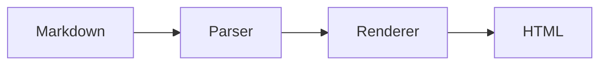
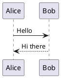

# updown Slide Format

## Slides

Every markdown file produces a slideshow. Slides are created by headings and horizontal rules.

### Headings

`#` (h1) and `##` (h2) start a new slide. The heading becomes the first element of that slide. Lower-level headings (`###` through `######`) do **not** create new slides.

```markdown
# First Slide

Content here.

## Second Slide

More content.

### Still on the second slide
```

### Horizontal Rules

`---` starts a new slide below it. The rule itself is not rendered.

```markdown
Some content on slide 1.

---

This is slide 2.
```

### Combined: `---` + Heading

A `---` followed by `#` or `##` produces **one** slide transition, not two.

```markdown
Slide 1 content.

---

## This starts slide 2 (not slide 3)
```

### Content Before Any Heading

Content that appears before the first heading or `---` goes into slide 1.

---

## Front Matter

YAML front matter at the top of the document is parsed as metadata for the slideshow container. It is never rendered as slide content.

````markdown
---
theme: dark
count: 42
tags:
  - a
  - b
class:
  - wide
  - centered
---

# First Slide
````

**Rules:**

- Values can be strings, numbers, or flat arrays of strings/numbers. Objects and nested arrays are ignored.
- Array values become space-separated strings.
- Keys are added as `data-fm-` prefixed attributes on the slideshow div.
- The `class` key is special — it becomes a regular `class` attribute (no prefix).
- The `theme` key selects the color theme (see [THEMES.md](THEMES.md)).

The example above produces:

```html
<div id="slideshow" class="wide centered" data-fm-theme="dark" data-fm-count="42" data-fm-tags="a b">
```

---

## Meta-Fences

A fenced code block with the language `meta` attaches metadata to a nearby element. It is never rendered.

### On Elements

Place a meta-fence directly after an element to add attributes to it:

````markdown
## My Heading

```meta
color: red
class:
  - highlight
  - large
```
````

This adds `data-meta-color="red"` and `class="highlight large"` to the `<h2>` tag. The same YAML rules as front matter apply (the `class` key has no prefix, everything else gets `data-meta-`).

### On Slides

Place a meta-fence directly after a `---` to add attributes to the slide div:

````markdown
---

```meta
class: dark-background
transition: fade
```

Content on this styled slide.
````

This adds `class="dark-background"` and `data-meta-transition="fade"` to the slide's wrapping `<div>`.

A `---` followed by a meta-fence and then a heading still produces a single slide transition:

````markdown
---

```meta
class: hero
```

# Welcome

The meta-fence styles the slide div, the heading is the first content.
````

---

## Code Fences

Fenced code blocks (other than `meta`) are rendered as HTML. If the language is recognized by Shiki, the code is syntax-highlighted with colors matching the current theme. Otherwise it falls back to plain rendering:

```html
<div class="fence {language}"><pre>{content}</pre></div>
```

The language identifier becomes a CSS class. Content is HTML-escaped in plain mode.

---

## Excalidraw Diagrams

Images referencing `.excalidraw` files are rendered as inline SVG, with Excalidraw's fonts embedded:

```markdown

```

The path is resolved relative to the markdown file. The alt text becomes an `aria-label` on the embedding element. If the file is missing or contains invalid JSON, an error message is shown in the slide.

### Obsidian Excalidraw format

Files saved by the [Obsidian Excalidraw plugin](https://github.com/zsviczian/obsidian-excalidraw-plugin) use a `.excalidraw.md` extension and store the drawing data as LZ-string compressed JSON inside an Obsidian comment block. These are supported directly:

```markdown

```

The compressed data is extracted and decompressed automatically. Rendering is otherwise identical to `.excalidraw` files.

Regular images (`.png`, `.jpg`, etc.) continue to render as normal `` tags.

---

## Mermaid Diagrams

Fenced code blocks with the language `mermaid` are rendered as diagrams in the browser:

````markdown

````

All diagram types supported by MermaidJS work — flowcharts, sequence diagrams, class diagrams, state diagrams, etc. The diagram theme automatically matches the slideshow theme (light themes use mermaid's "default" theme, dark themes use "dark").

The mermaid library is only loaded when the document contains mermaid code fences.

---

## PlantUML Diagrams

Fenced code blocks with the language `plantuml` are rendered as diagrams via a local PlantUML server:

````markdown

````

A PlantUML server is started automatically when the document contains plantuml code fences and `--plantuml-jar <path>` is provided on the command line. Without the argument, plantuml blocks are rendered as plain code blocks. The server requires Java and the PlantUML JAR file. The server port defaults to 18123 (overridable via `PLANTUML_PORT`).

All diagram types supported by PlantUML work — sequence diagrams, class diagrams, activity diagrams, component diagrams, etc.

---

## Slide Structure

The rendered HTML follows this structure:

```html
<div id="slideshow" {front-matter-attributes}>
  <div id="slide-1" class="slide first {slide-meta-classes}" {slide-meta-attrs}>
    <!-- slide content -->
  </div>
  <div id="slide-2" class="slide" ...>...</div>
  <div id="slide-N" class="slide last" ...>...</div>
</div>
```

- The first slide div gets the class `first`, the last gets `last`.
- A single-slide deck gets both `first` and `last`.

---

## Themes and Styles

The `theme` front matter key selects the color scheme. The `style` key controls typography and layout. Any theme works with any style.

```markdown
---
theme: catppuccin-mocha
style: modern
---
```

14 built-in themes and 5 style presets are available, plus support for external theme directories with custom fonts, logos, colors, and light/dark variants.

See [THEMES.md](THEMES.md) for full details — built-in themes and styles, CSS custom properties, external theme directories, and theme variants.

---

## Columns

Use `+++` to split slide content into columns. Each `+++` creates a new column boundary.

```markdown
## Comparison

Left column content.

- Item 1
- Item 2

+++

Right column content.

- Item A
- Item B
```

This produces:

```html
<div id="slide-1" class="slide first last">
  <h2>Comparison</h2>
  <div class="columns">
    <div class="column">
      <p>Left column content.</p>
      <ul><li>Item 1</li><li>Item 2</li></ul>
    </div>
    <div class="column">
      <p>Right column content.</p>
      <ul><li>Item A</li><li>Item B</li></ul>
    </div>
  </div>
</div>
```

### Rules

- `+++` is a **within-slide** separator — it does not create a new slide
- `+++` is not rendered (it is consumed, like `---`)
- Multiple `+++` produce multiple columns
- Headings (`#`/`##`) before the first `+++` span the full width (rendered above the columns)
- Non-heading content before the first `+++` goes into the first column
- Columns are laid out using CSS grid (`repeat(auto-fit, minmax(0, 1fr))`) and work with any theme
- Slides with columns get a `has-columns` class; padding moves from the slide to each column, so column backgrounds fill edge-to-edge

### Styling columns

Because each column handles its own padding, setting a background color on a `.column` fills the full grid cell from edge to edge. Use a slide-level meta-fence class to target specific columns:

````markdown
---

```meta
class: accent-last-column
```

## Comparison

Left content.

+++

Right content with accent background.
````

The built-in `accent-last-column` utility sets the last column's background to the theme's code background color (`--code-bg`). Custom classes can be styled via an external CSS file (see [THEMES.md](THEMES.md)).

---

## Keyboard Controls

| Key | Action |
|---|---|
| ArrowRight | Next slide |
| ArrowLeft | Previous slide |
| f | Toggle fullscreen |
| Escape | Exit fullscreen |

---

## Auto-Scaling

Slide content is automatically scaled to fit the viewport. When content would overflow the visible area, the font size is reduced until everything fits. If the content fits at the default size, no scaling is applied.

### Headings

`h1` and `h2` headings use fixed `rem`-based sizes that are immune to auto-scaling. This keeps slide titles stable while body text, code blocks, and lower-level headings (`h3`–`h6`) scale down to fit.

### SVG Diagrams

Mermaid, PlantUML, and Excalidraw diagrams automatically scale to fill the available space on the slide. The SVG containers participate in the slide's flex layout — after headings and text take their natural size, diagrams fill the remaining vertical space while preserving their aspect ratio.

This behavior is on by default. To disable it and use natural SVG sizes instead, set `svg-scaling` to `false` in front matter:

```markdown
---
svg-scaling: false
---
```

After asynchronous diagram rendering (Mermaid and PlantUML render client-side), the slide is re-fitted automatically.
