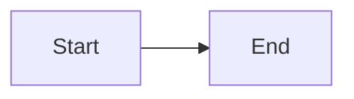

## Overview
Support rendering MermaidJS diagrams in slides using fenced code blocks with the `mermaid` language tag. Diagrams are pre-rendered server-side to inline SVG using the same async pre-processing pattern as Excalidraw.

## Markdown Syntax
````markdown

````

## Dependency
```
bun add mermaid
```

## Implementation

### 1. Mermaid renderer (`src/mermaid/index.ts`)
Export an async function:
```typescript
export async function renderMermaid(id: string, content: string, theme: string): Promise<string>
```
- Import and configure mermaid with `mermaid.initialize({ theme })`
- Call `mermaid.render(id, content)` to produce SVG
- Return the SVG string
- Handle errors gracefully — return a visible `<div class="mermaid-error">` message
- The `id` parameter must be unique per diagram (mermaid requires it); use a counter or content-based id
- The `theme` parameter maps from the updown theme to a mermaid theme (`"default"` for light themes, `"dark"` for dark themes)

The happy-dom shim from `src/excalidraw/dom-shim.ts` must be imported before mermaid (same pattern as Excalidraw). Import it directly rather than duplicating.

### 2. Theme mapping
Map updown themes to mermaid themes:
- `light` → `"default"`
- `dark` → `"dark"`
- `catppuccin-latte` → `"default"`
- `catppuccin-mocha` → `"dark"`

Add a `mermaidTheme` field to the `Theme` type in `src/styles/themes.ts` (same pattern as `shikiTheme`).

### 3. Pre-process in controller (`src/index.ts`)
In `loadAndRender()`, after parsing the slideshow:
- Walk all slides and collect `code` nodes with `lang: "mermaid"`
- Pre-render each unique diagram content via `renderMermaid()`
- Store results in a `Map<string, string>` (diagram content → SVG string)
- Create a `FencePlugin` whose synchronous `render(content)` looks up the pre-rendered SVG from the map
- Register the plugin on `fenceRegistry` before calling `render()`

### 4. CSS for Mermaid embeds (`src/styles/base.ts`)
```css
.fence.mermaid svg {
  max-width: 100%;
  height: auto;
}
```

## Files to modify
- `package.json` — add `mermaid`
- `src/mermaid/index.ts` — new, mermaid SVG renderer
- `src/styles/themes.ts` — add `mermaidTheme` field to `Theme` type and each theme
- `src/styles/base.ts` — CSS for mermaid SVGs
- `src/index.ts` — pre-process mermaid fences, register plugin

## Edge cases
- Invalid mermaid syntax → render visible error message in slide
- No mermaid fences → no overhead (empty map, plugin still registered but never matched)
- Duplicate diagram content → render once, reuse from map
- Mermaid's `render()` requires unique element IDs — generate sequential IDs like `mermaid-0`, `mermaid-1`

## Acceptance Criteria
- [ ] ` ```mermaid ` fenced code blocks render as inline SVG in the slide
- [ ] Mermaid uses `"default"` theme on light slides and `"dark"` theme on dark slides
- [ ] Invalid mermaid syntax shows an error message in the slide
- [ ] Existing code fences (Shiki, plain, meta) continue to work unchanged
- [ ] All existing tests pass
- [ ] New tests cover mermaid rendering and error handling