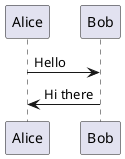

## Overview
Support rendering PlantUML diagrams in slides using fenced code blocks with the `plantuml` language tag. Diagrams are rendered client-side: a local PlantUML picoweb server runs as a subprocess, updown proxies requests to it, and client-side JS replaces `<pre class="plantuml">` elements with inline SVG.

## Markdown Syntax
````markdown

````

## Prerequisites
- Java (JRE/JDK) installed on the host
- `plantuml.jar` available locally (path configurable via `PLANTUML_JAR` env var, default: `./plantuml.jar`)

## Architecture

```
Browser                    updown server              PlantUML picoweb
  |                            |                            |
  |  GET /                     |                            |
  |<--- HTML with <pre class="plantuml">                    |
  |                            |                            |
  |  POST /plantuml/render     |                            |
  |  { source: "..." }  ----->|  POST /render               |
  |                            |  { source, options }  ---->|
  |                            |<--- SVG response           |
  |<--- SVG response           |                            |
  |                            |                            |
  | (JS replaces <pre> with SVG)                            |
```

## Implementation

### 1. PlantUML subprocess manager (`src/plantuml/server.ts`)
New module that manages the picoweb subprocess lifecycle:
- `startPlantUMLServer(): Promise<{ port: number, stop: () => void }>`
  - Locate JAR: `process.env.PLANTUML_JAR ?? "./plantuml.jar"`
  - Check JAR exists, check `java` is on PATH (via `Bun.$`)
  - Pick a random available port
  - Spawn: `java -jar plantuml.jar -picoweb:{port}:127.0.0.1`
  - Poll `http://127.0.0.1:{port}/serverinfo` until ready (with timeout)
  - Return port and a stop function that kills the subprocess
- Handle errors gracefully: missing Java, missing JAR, startup timeout

### 2. PlantUML render function (`src/plantuml/index.ts`)
- `async function renderPlantUML(source: string, port: number): Promise<string>`
  - POST to `http://127.0.0.1:{port}/render` with body `{ "source": source, "options": ["-tsvg"] }`
  - Return the SVG string on success
  - Return `<div class="plantuml-error">...</div>` on failure

### 3. Client-side script (`src/plantuml/client.ts`)
Export a function `generatePlantUMLScript(): string` that returns raw JS (no script tags):
- On DOMContentLoaded, find all `pre.plantuml` elements
- For each, POST its `textContent` to `/plantuml/render`
- On success, replace the `<pre>` parent (`.fence-plantuml`) innerHTML with the SVG
- On failure, show error message in the element

### 4. FencePlugin registration (in `src/index.ts`)
- Detect `plantuml` code fences (same scan pattern as mermaid)
- If found, start the PlantUML server subprocess
- Register FencePlugin: `{ lang: "plantuml", render(content) { return '<div class="fence fence-plantuml"><pre class="plantuml">${content}</pre></div>'; } }`
- Pass the client script to the renderer

### 5. Proxy endpoint (in `src/index.ts` server)
Add route to `Bun.serve()` fetch handler:
- `POST /plantuml/render` — read JSON body `{ source }`, forward to picoweb `POST /render` with `{ source, options: ["-tsvg"] }`, return SVG response
- Only active when PlantUML server is running

### 6. Renderer changes (`src/renderer/index.ts`)
- Add optional `plantumlScript?: string` parameter (same pattern as `mermaidScript`)
- If present, emit `<script>{plantumlScript}</script>` in the HTML body

### 7. CSS (`src/styles/base.ts`)
```css
.fence-plantuml svg {
  max-width: 100%;
  height: auto;
}
```

### 8. Subprocess cleanup
- Kill the PlantUML subprocess on:
  - Normal exit (quit via `q`)
  - SIGINT/SIGTERM
  - Server stop
- Use `process.on("exit", ...)` or similar

## Files to create/modify
- `src/plantuml/server.ts` — new, subprocess manager
- `src/plantuml/index.ts` — new, render function
- `src/plantuml/client.ts` — new, client-side script generator
- `src/index.ts` — start server, register plugin, add proxy route
- `src/renderer/index.ts` — add `plantumlScript` parameter
- `src/styles/base.ts` — CSS for plantuml SVGs
- `tests/plantuml/` — new tests

## Edge cases
- Java not installed → log warning, render error message in slide
- JAR not found → log warning, render error message in slide
- PlantUML server fails to start → timeout, show errors in slides
- No plantuml fences → no subprocess spawned, zero overhead
- Invalid PlantUML syntax → picoweb returns error, show in slide
- Multiple diagrams → client-side JS renders them in parallel

## Acceptance Criteria
- [ ] ` ```plantuml ` fenced code blocks render as inline SVG in the slide
- [ ] PlantUML server only starts when plantuml fences are detected
- [ ] Clear error message when Java or plantuml.jar is not available
- [ ] Invalid PlantUML syntax shows an error message in the slide
- [ ] Subprocess is cleaned up on exit
- [ ] Existing features (mermaid, excalidraw, shiki, navigation) unchanged
- [ ] All existing tests pass
- [ ] New tests cover PlantUML rendering and error handling