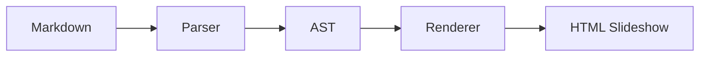
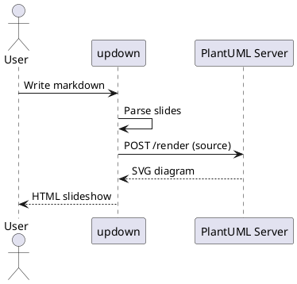

# Welcome to updown

A markdown-to-slideshow application.

## Text Formatting

This slide shows **bold text**, *italic text*, and ***bold italic*** together.

You can also use ~~strikethrough~~ and `inline code` in a sentence.

Here is a [link to example.com](http://example.com) for good measure.

## Lists and Nesting

Unordered list:

- Apples
- Bananas
  - Cavendish
  - Plantain
- Cherries
  - Bing
  - Rainier
    - Extra sweet

Ordered list:

1. First step
2. Second step
3. Third step

---

## Code Blocks

```javascript
function greet(name) {
  return `Hello, ${name}!`;
}

console.log(greet("World"));
```

```python
def fibonacci(n):
    a, b = 0, 1
    for _ in range(n):
        yield a
        a, b = b, a + b

print(list(fibonacci(10)))
```

---

```meta
class: special-slide
data-topic: quotes
```

## Blockquotes

> The best way to predict the future is to invent it.
> — Alan Kay

> Simplicity is the ultimate sophistication.
> — Leonardo da Vinci

## Tables

| Feature       | Status    | Priority |
|---------------|-----------|----------|
| Parser        | Complete  | High     |
| Renderer      | Complete  | High     |
| Navigation    | Complete  | Medium   |
| Themes        | Planned   | Low      |

---

## Images and Mixed Content

Here is a paragraph with **bold**, *italic*, `code`, and a [link](http://example.com) all in one line.


Another paragraph below the image.

---

## Mermaid Diagram



---

## Excalidraw Diagram


Excalidraw drawings are rendered as inline SVG.

---

## PlantUML Diagram



---

```meta
class: closing
```

## Thank You

This concludes the demo slideshow.

Built with **updown** — markdown to slides, instantly.
