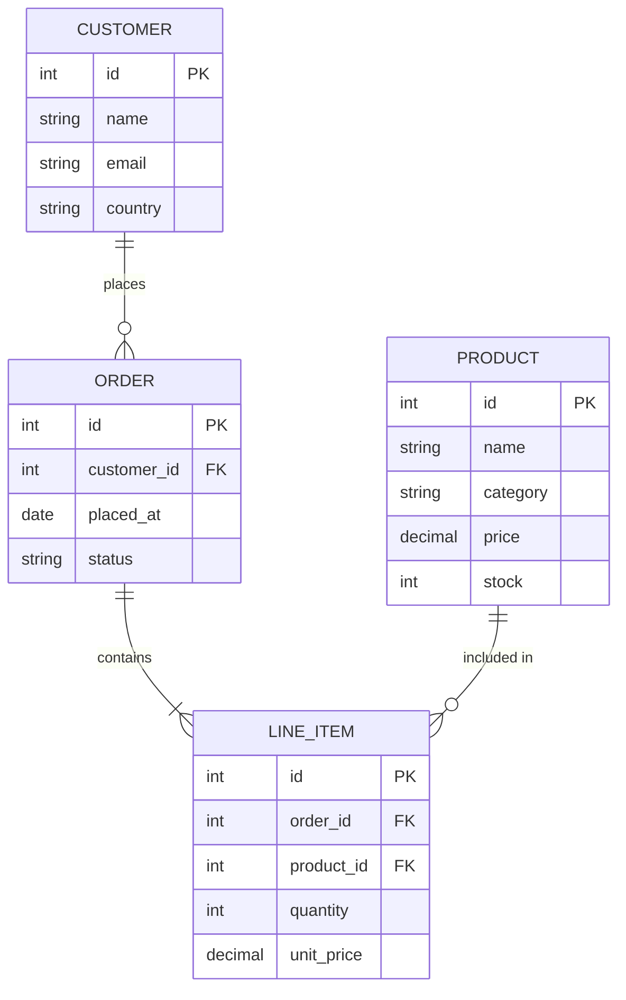

# Diagram Rendering Tests

Testing Mermaid and PlantUML across diagram types and complexity levels.

---

# Mermaid Diagrams

---

## Mermaid — Flowchart (Simple)


## Mermaid — Flowchart (Complex)


## Mermaid — Sequence (Simple)


## Mermaid — Sequence (Complex)


## Mermaid — Class Diagram (Simple)


## Mermaid — Class Diagram (Complex)


## Mermaid — State Diagram (Simple)


## Mermaid — State Diagram (Complex)


## Mermaid — ER Diagram



## Mermaid — Gantt Chart


## Mermaid — Pie Chart


## Mermaid — Git Graph


## Mermaid — Mindmap


## Mermaid — Timeline


## Mermaid — Quadrant Chart


## Mermaid — XY Chart


---

# PlantUML Diagrams

---

## PlantUML — Sequence (Simple)


## PlantUML — Sequence (Complex)


## PlantUML — Use Case


## PlantUML — Class Diagram


## PlantUML — Activity Diagram

```plantuml
@startuml
start
:User submits registration form;

if (Email already exists?) then (yes)
    :Return 409 Conflict;
    stop
else (no)
endif

if (Password meets policy?) then (no)
    :Return 400 Bad Request;
    stop
else (yes)
endif

:Hash password;
:Create user record in DB;
:Generate email verification token;

fork
    :Send welcome email;
fork again
    :Send verification email;
end fork

:Return 201 Created;
:User clicks verification link;

if (Token valid & not expired?) then (yes)
    :Mark email as verified;
    :Activate account;
    :Redirect to dashboard;
else (no)
    :Show expiry error;
    :Offer resend option;
endif

stop
@enduml
```

## PlantUML — Component Diagram

```plantuml
@startuml
skinparam componentStyle rectangle

package "Client Tier" {
    [Web Browser]
    [Mobile App]
}

package "Edge Layer" {
    [CDN]
    [API Gateway]
    [Load Balancer]
}

package "Application Services" {
    [Auth Service]
    [User Service]
    [Product Service]
    [Order Service]
    [Notification Service]
}

package "Data Layer" {
    database "PostgreSQL"
    database "Redis"
    queue "RabbitMQ"
}

[Web Browser] --> [CDN]
[Mobile App] --> [CDN]
[CDN] --> [API Gateway]
[API Gateway] --> [Load Balancer]
[Load Balancer] --> [Auth Service]
[Load Balancer] --> [User Service]
[Load Balancer] --> [Product Service]
[Load Balancer] --> [Order Service]

[Auth Service] --> [Redis]
[User Service] --> [PostgreSQL]
[Product Service] --> [PostgreSQL]
[Order Service] --> [PostgreSQL]
[Order Service] --> [RabbitMQ]
[RabbitMQ] --> [Notification Service]
@enduml
```

## PlantUML — Deployment Diagram

```plantuml
@startuml
node "Client Devices" {
    node "Desktop"
    node "Mobile"
}

cloud "AWS Region eu-west-1" {
    node "Availability Zone A" {
        node "App Server 1" {
            component "Node.js :3000"
        }
        database "Postgres Primary"
    }
    node "Availability Zone B" {
        node "App Server 2" {
            component "Node.js :3000"
        }
        database "Postgres Replica"
    }
    node "Shared Services" {
        component "ALB (Load Balancer)"
        component "ElastiCache (Redis)"
        component "S3 (Static Assets)"
    }
}

"Client Devices" --> "ALB (Load Balancer)"
"ALB (Load Balancer)" --> "App Server 1"
"ALB (Load Balancer)" --> "App Server 2"
"App Server 1" --> "Postgres Primary"
"App Server 2" --> "Postgres Replica"
"Postgres Primary" --> "Postgres Replica" : replication
"App Server 1" --> "ElastiCache (Redis)"
"App Server 2" --> "ElastiCache (Redis)"
@enduml
```

## PlantUML — State Diagram

```plantuml
@startuml
[*] --> Draft

Draft --> Review : submit()
Draft --> [*] : discard()

Review --> Draft : reject(feedback)
Review --> Approved : approve()

Approved --> Published : publish()
Approved --> Draft : request_changes()

Published --> Archived : archive()
Published --> Draft : unpublish()

Archived --> [*]

note right of Draft : Author is editing
note right of Review : Awaiting manager sign-off
note right of Published : Live and visible to all
@enduml
```

## PlantUML — Gantt

```plantuml
@startgantt
Project starts 2025-03-01

[Discovery] lasts 7 days
[Design] starts at [Discovery]'s end and lasts 5 days

[Backend API] starts at [Design]'s end and lasts 12 days
[Frontend UI] starts at [Design]'s end and lasts 14 days

[Integration testing] starts at [Backend API]'s end and lasts 6 days
[UAT] starts at [Integration testing]'s end and lasts 4 days

[Backend API] is 60% completed
[Frontend UI] is 40% completed

[Go-live] happens at [UAT]'s end
@endgantt
```

## PlantUML — MindMap

```plantuml
@startmindmap
* System Design
** Frontend
*** React SPA
**** Component library
**** State management
*** Performance
**** Code splitting
**** CDN caching
** Backend
*** REST API
**** Auth endpoints
**** Resource CRUD
*** Background jobs
**** Email queue
**** Report generation
** Data
*** Primary DB
**** PostgreSQL
**** Migrations
*** Cache
**** Redis
**** TTL strategy
** Operations
*** CI/CD
*** Monitoring
*** Alerting
@endmindmap
```

## PlantUML — WBS

```plantuml
@startwbs
* Platform v2.0
** Planning
*** Stakeholder interviews
*** Requirements doc
*** Technical spec
** Design
*** UX wireframes
*** Visual design
*** Design review
** Engineering
*** Auth module
**** OAuth integration
**** Session management
*** API layer
**** Endpoint design
**** Rate limiting
*** Frontend
**** Component build
**** Routing
** QA
*** Unit tests
*** Integration tests
*** Performance tests
** Release
*** Staging deploy
*** Production deploy
*** Post-launch monitoring
@endwbs
```

## PlantUML — JSON

```plantuml
@startjson
{
  "id": "usr_7f3k2",
  "name": "Ada Lovelace",
  "email": "ada@example.com",
  "active": true,
  "roles": ["admin", "editor"],
  "profile": {
    "title": "Senior Engineer",
    "department": "Platform",
    "location": "London",
    "joinedAt": "2022-09-01"
  },
  "preferences": {
    "theme": "dark",
    "notifications": true,
    "timezone": "Europe/London"
  },
  "stats": {
    "loginCount": 843,
    "lastLogin": "2025-02-19T09:14:22Z",
    "storageUsedMB": 1240
  }
}
@endjson
```
